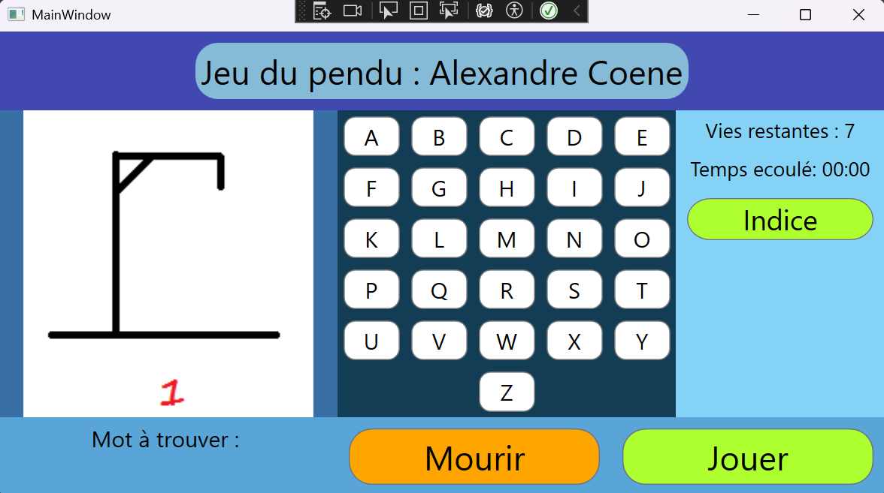

# 🎮 Jeu du Pendu WPF

Un jeu du pendu interactif développé en C# avec .NET WPF.

## 🚀 Fonctionnalités

- Sélection aléatoire de mots à deviner  
- Interface utilisateur simple et intuitive  
- Affichage du mot caché avec les lettres découvertes  
- Nombre limité d'erreurs avant la défaite  
- Support du clavier pour entrer les lettres  

## 🛠 Technologies utilisées

- C#  
- .NET WPF  
- XAML pour l'interface graphique  

## 📸 Aperçu



## 💻 Installation et exécution

1. Clonez le projet :
   ```sh
   git clone https://github.com/votre-utilisateur/votre-repo.git
   ```
2. Ouvrez le projet dans Visual Studio
3. Compilez et exécutez

## 📝 Auteurs

- **Coene Alexandre** - [GitHub](https://github.com/AlexandreCoene)
